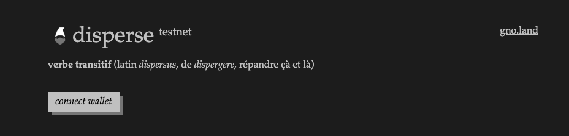
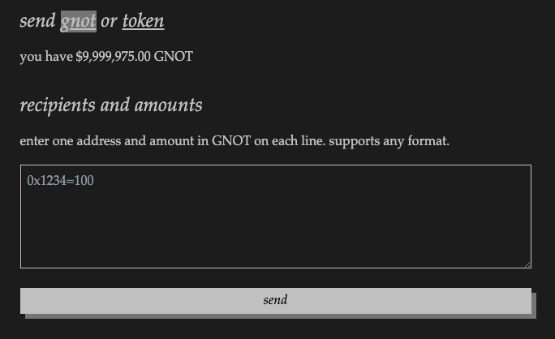
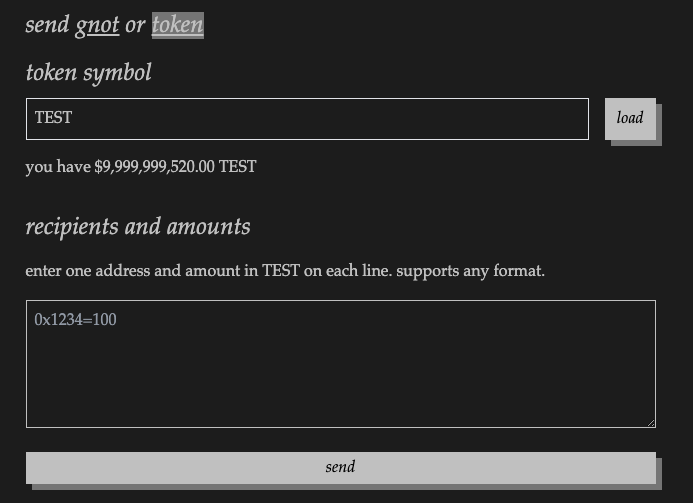

# Disperse - Gno

This repo contains the gno version of [disperse](https://disperse.app/), a simple way to send various amounts of coins or tokens to separate addresses on the blockchain.



## Installation

`git clone https://github.com/agherasie/gno-disperse.git`

### Frontend
```sh
cd front/
bun install
bun run dev
```
> app available @ http://localhost:5173 by default

### Api
```sh
gnodev api/
```
> docs available @ http://localhost:8888/r/demo/disperse by default

## Usage

### Gnot dispersing

You can disperse GNOTs by simply filling the addresses and corresponding amounts that you wish to send inside the webapp.



You can also use the cli by specifying the total amount with the `send` parameter :

```sh
gnokey maketx call -pkgpath "gno.land/r/demo/disperse" -func "DisperseGnotString" -gas-fee 1000000ugnot -gas-wanted 2000000 -send "200ugnot" -broadcast -chainid "dev" -args "g1dmt3sa5ucvecxuhf3j6ne5r0e3z4x7h6c03xc0,g1akeqsvhucjt8gf5yupyzjxsjd29wv8fayng37c" -args "100,100" -remote "tcp://127.0.0.1:26657" MyKey
```

### Token dispersing

Before using the token disperse functionality, you must first grant an allowance to the `r/demo/disperse` contract so that it can use your funds.

```sh
gnokey maketx call -pkgpath "gno.land/r/demo/grc20factory" -func "Approve" -gas-fee 1000000ugnot -gas-wanted 2000000 -send "" -broadcast -chainid "dev" -args "TEST" -args "g1yryw6qs8h9anvguu4dfdc0u7zh4gvv8vqf59sj" -args "200" -remote "tcp://127.0.0.1:26657" MyKey
```

Once you have granted `disperse` the allowance, you can proceed with the web app by filling the form



Or you can run the following command using gnokey :

```sh
gnokey maketx call -pkgpath "gno.land/r/demo/disperse" -func "DisperseTokenString" -gas-fee 1000000ugnot -gas-wanted 2000000 -send "" -broadcast -chainid "dev" -args "TEST" -args "g1dmt3sa5ucvecxuhf3j6ne5r0e3z4x7h6c03xc0,g1akeqsvhucjt8gf5yupyzjxsjd29wv8fayng37c" -args "100,100" -remote "tcp://127.0.0.1:26657" MyKey
```
